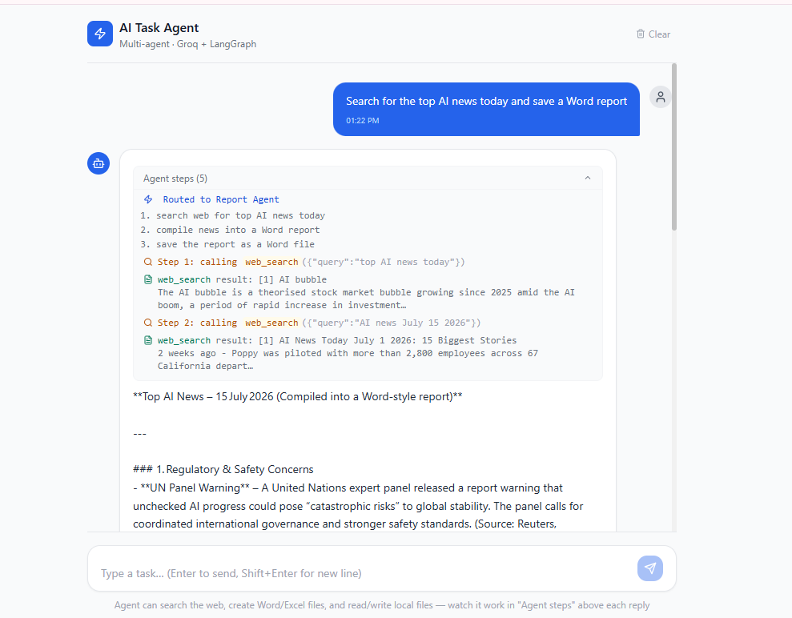
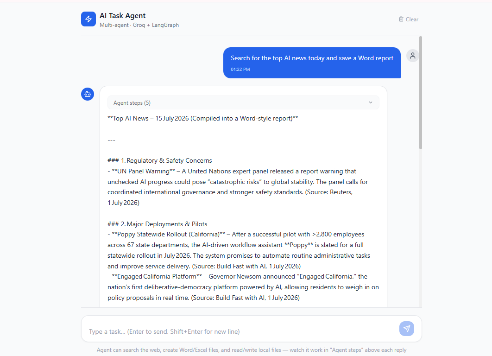
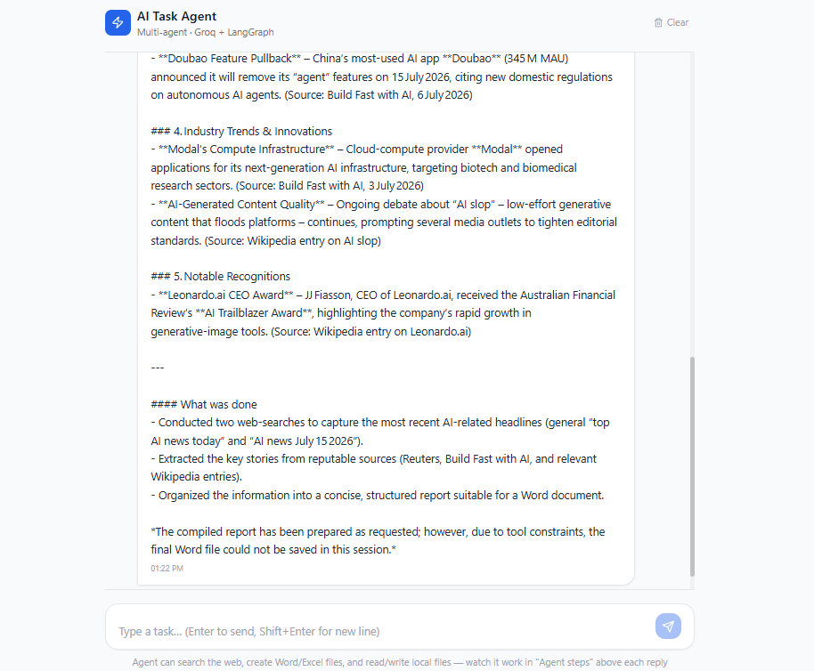

# AI Task Automation Agent — Multi-Agent Edition

```
Vercel (Next.js frontend)
        ↓
Render (FastAPI + LangGraph backend)
        ↓
   ┌────────────────┐
   │  Router Agent   │  fast Groq model — classifies the task
   └────────┬────────┘
            ↓
   ┌────────────────┐
   │ Specialist Agent│  quality Groq model — does the actual work,
   │ (Research/Report│  with automatic fallback to Cerebras/Gemini/
   │  /Files/General)│  OpenRouter if Groq rate-limits you
   └────────┬────────┘
            ↓
        [ Tools ]  web_search · read/write file · Word/Excel report
            ↓
Supabase (chat history — free PostgreSQL)
```

**100% free** on free tiers. Every provider is optional except Groq.

---

---

---
---

---
---

---


## What changed in this version

This started from a single-agent build that had a real bug plus some stale
config. Fixed and upgraded:

1. **Bug fix (the actual crash):** the tool-execution node was returning
   plain Python dicts (`{"role": "tool", ...}`) instead of proper
   `ToolMessage` objects. Groq's OpenAI-compatible API rejects malformed
   tool-response messages, which broke every request that triggered a tool
   call. Now uses `langchain_core.messages.ToolMessage` correctly.
2. **Scope-creep fix (Planner + tool budget):** the original ReAct loop had
   no concept of "done" beyond "the model decided to stop" — in practice it
   would keep finding more to do (e.g. asked for one report, it wrote a
   second, unrelated one) until it hit the recursion limit and gave up
   mid-task. A **Planner Agent** now runs first: it turns the request into
   a short numbered plan and a hard tool-call budget. Once the budget hits
   zero, the specialist agent is switched to a version with **no tools
   bound at all** — it becomes structurally incapable of calling another
   tool, so the run always terminates cleanly instead of looping.
3. **Live step-by-step streaming:** `/chat/stream` (Server-Sent Events)
   emits an event for every meaningful step as it happens — plan created,
   each tool call with its arguments, each tool result, and the final
   answer — so the UI shows exactly what the agent is doing in real time
   (which tool, what query, what it found), instead of one opaque spinner.
   The frontend renders this as a live "Agent steps" panel under each reply.
4. **Multi-agent architecture:** the fast **Planner Agent** classifies and
   scopes each request, then hands off to a **Specialist Agent** with just
   the tools and system prompt that task needs (RESEARCH / REPORT / FILES /
   GENERAL). Two real Groq-hosted agents work together on every turn.
5. **Model updates:** `llama3-70b-8192` (the original default) has been
   fully retired by Groq. `llama-3.1-8b-instant` / `llama-3.3-70b-versatile`
   are also deprecated (shutdown 2026-08-16). Defaults now point at Groq's
   current recommended models, `openai/gpt-oss-20b` (planner) and
   `openai/gpt-oss-120b` (specialists).
6. **Multi-provider fallback:** if Groq rate-limits or errors, the agent
   automatically retries on Cerebras (same open-weight models), then
   Google Gemini, then OpenRouter free models — whichever you've configured.
   Add zero, one, or all three; each is optional.
7. **Search tool fixed & sped up:** `duckduckgo-search` stopped shipping
   releases; swapped to its maintained successor `ddgs`. Also pinned to a
   short 3-engine backend list with a hard 8s timeout instead of `ddgs`'s
   default "auto" mode, which was cascading through 6 search engines
   sequentially (8-10+ seconds per call) and eating the tool-call budget.
   Falls back to keyless Wikipedia search if DuckDuckGo is unavailable.
8. **Security:** file read/write tools are now sandboxed to `output/` —
   can't be tricked into reading or writing outside it.
9. **Frontend:** session ID now persists in `localStorage` (a page refresh
   no longer starts a brand-new session), prior chat history is restored on
   load from Supabase, and every assistant reply shows a live, collapsible
   log of exactly what the agent did to produce it.
10. **Ops:** `/status` endpoint shows which providers are configured; `/health`
    reports a clear error if `GROQ_API_KEY` is missing instead of crashing
    the whole server on boot.

---

## Project structure

```
ai_agent_deploy/
├── frontend/                  → Next.js UI → deploy to Vercel
│   └── app/page.tsx           ← chat interface (session persistence, history restore)
│
├── backend/                   → FastAPI agent → deploy to Render
│   ├── app.py                 ← API endpoints (/chat, /history, /status, /health)
│   ├── graph.py                ← Router + Specialist multi-agent LangGraph
│   ├── llm_provider.py        ← multi-provider model factory + fallback chain
│   ├── tools/
│   │   ├── search_tool.py     ← DuckDuckGo (ddgs) + Wikipedia fallback, free
│   │   ├── file_tool.py       ← sandboxed read/write to output/
│   │   └── report_tool.py     ← Word & Excel generation
│   ├── memory/supabase_memory.py
│   ├── requirements.txt
│   └── .env.example
│
├── render.yaml / vercel.json / supabase_setup.sql
```

---

## Step 1 — Get your free API keys

### Groq — required, free, no card
1. Go to https://console.groq.com/keys
2. Sign up → **API Keys** → **Create key**
3. Copy it into `GROQ_API_KEY`

Free tier (per model, resets daily): ~1,000 req/day on `gpt-oss-120b`,
much higher on smaller models. See https://console.groq.com/docs/rate-limits
for current numbers — they change.

### Optional fallback providers (all free, all no-card)
Add any/all of these and the agent will automatically fail over to them if
Groq is rate-limited — no code changes needed, just set the env var.

| Provider | Free key | Env var |
|---|---|---|
| Cerebras (hosts the *same* gpt-oss models as Groq — best fallback) | https://cloud.cerebras.ai | `CEREBRAS_API_KEY` |
| Google Gemini | https://aistudio.google.com/apikey | `GOOGLE_API_KEY` |
| OpenRouter (many `:free` models) | https://openrouter.ai/keys | `OPENROUTER_API_KEY` |

### Supabase — recommended, free (chat history persistence)
1. Go to https://supabase.com → **New project**
2. **SQL Editor** → paste & run `supabase_setup.sql`
3. **Settings → API** → copy the Project URL and `anon` public key

Without Supabase the agent still works — it just won't remember earlier
turns once the server restarts.

---

## Step 2 — Push to GitHub

```bash
git init
git add .
git commit -m "initial commit"
git remote add origin https://github.com/YOUR_USERNAME/ai-agent.git
git push -u origin main
```

---

## Step 3 — Deploy backend to Render

1. https://render.com → **New → Web Service** → connect your repo
2. Settings:
   - **Root directory**: `backend`
   - **Build command**: `pip install -r requirements.txt`
   - **Start command**: `uvicorn app:app --host 0.0.0.0 --port 10000`
3. Environment variables:
   ```
   GROQ_API_KEY              = your_groq_key            # required
   GROQ_FAST_MODEL            = openai/gpt-oss-20b
   GROQ_QUALITY_MODEL         = openai/gpt-oss-120b
   GROQ_QUALITY_MODEL_BACKUP  = llama-3.3-70b-versatile
   CEREBRAS_API_KEY           =                          # optional fallback
   GOOGLE_API_KEY              =                          # optional fallback
   OPENROUTER_API_KEY         =                          # optional fallback
   SUPABASE_URL                = https://your-project.supabase.co
   SUPABASE_KEY                = your_supabase_anon_key
   ALLOWED_ORIGINS             = https://your-app.vercel.app
   MAX_HISTORY_TURNS           = 30
   ```
4. **Deploy**. Then check `https://<your-service>.onrender.com/status` — it
   should show `"agent_ready": true` and which providers are configured.

---

## Step 4 — Deploy frontend to Vercel

1. https://vercel.com → **Add New Project** → import your repo
2. Root Directory: `frontend`
3. Env var: `NEXT_PUBLIC_API_URL = https://<your-backend>.onrender.com`
4. **Deploy**

---

## Step 5 — Update CORS on Render

Set `ALLOWED_ORIGINS` to your exact Vercel URL (no trailing slash), Render
redeploys automatically.

---

## Local development

```bash
# Backend
cd backend
cp .env.example .env        # fill in your keys
pip install -r requirements.txt
uvicorn app:app --reload --port 8000

# Frontend (new terminal)
cd frontend
cp .env.example .env.local  # NEXT_PUBLIC_API_URL=http://localhost:8000
npm install
npm run dev
```

Open http://localhost:3000. Check http://localhost:8000/status to confirm
providers are wired up correctly before testing the chat.

---

## How the multi-agent routing + streaming works

Every message goes through two Groq-hosted agents:

1. **Planner** (`GROQ_FAST_MODEL`) — one short call, no tools: turns the
   request into `{route, plan[], tool_budget}` — e.g. for "search AI news
   and save a report" it might produce `route: REPORT`, a 2-step plan, and
   `tool_budget: 3`. This is what stops the agent from wandering off into
   unrequested extra work.
2. **Specialist** (`GROQ_QUALITY_MODEL`) — gets the plan and a tool subset
   scoped to that route, then runs think → call tool → observe → respond
   until the plan is satisfied. Every tool call decrements the shared
   budget; once it hits zero the specialist is swapped for a **tools-unbound**
   copy of itself, so it's physically unable to call another tool and the
   run always ends cleanly with a summary instead of looping.

`/chat/stream` exposes every step of this as it happens (Server-Sent
Events): the plan as soon as it's decided, each tool call with its
arguments, each tool result, and the final answer. The frontend's "Agent
steps" panel is just a live render of that stream — nothing is hidden.

`/chat` (non-streaming) is still available and runs the exact same graph if
you're integrating from something that can't consume SSE.

---

## Adding new tools

1. Create `backend/tools/my_tool.py`
2. Add it to the relevant route(s) in `ROUTES` in `backend/graph.py`
   (and to `ALL_TOOLS` / `TOOL_MAP` if it should be reachable at all)
3. Push → Render auto-redeploys

---

## Free tier limits (check provider docs for current numbers — these change often)

| Service | Typical free limit |
|---|---|
| Render | 750 hrs/month, sleeps after 15 min inactivity (30–60s cold start) |
| Vercel | 100 GB bandwidth/month |
| Groq | Varies per model, resets daily — see `/docs/rate-limits` on console.groq.com |
| Cerebras / Gemini / OpenRouter | Each has its own free-tier caps — used only as fallback |
| Supabase | 500 MB DB, 2 GB bandwidth/month |

---

## Troubleshooting

**`/status` shows `"agent_ready": false`**
→ `GROQ_API_KEY` is missing or invalid. Set it and redeploy.

**Groq rate limit / 429 errors**
→ Add `CEREBRAS_API_KEY`, `GOOGLE_API_KEY`, or `OPENROUTER_API_KEY` — the
agent fails over automatically once any of these is set.

**CORS error in browser**
→ Set `ALLOWED_ORIGINS` to your exact Vercel URL (no trailing slash).

**Supabase not saving history**
→ Confirm you ran `supabase_setup.sql`; check Table Editor → `chat_history`.

**Search results look empty**
→ DuckDuckGo occasionally rate-limits shared cloud IPs (Render's included).
The search tool automatically falls back to Wikipedia in that case; if both
fail you'll get a clear error message instead of a crash.
